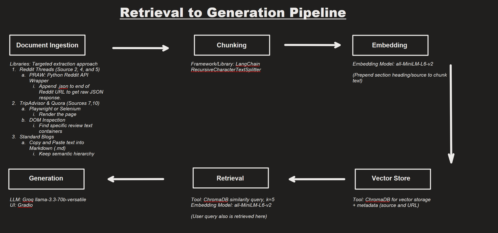

# Project 1 Planning: The Unofficial Guide

> Write this document before you write any pipeline code.
> Your spec and architecture diagram are what you'll use to direct AI tools (Claude, Copilot, etc.) to generate your implementation — the more specific they are, the more useful the generated code will be.
> Update the Retrieval Approach and Chunking Strategy sections if you change your approach during implementation.
> Update this file before starting any stretch features.

---

## Domain

<!-- What domain did you choose? Why is this knowledge valuable and hard to find through official channels? -->

Domain: Activities to do at/around the University of Florida
This knowledge is valuable cause it lets students know what kind of activities and experiences they can do in their free-time when attending the University of Florida and for who and when these activities are appropriate. Although you can find some events happening on campus through official channels, knowing all of the possible activites to do around Gainesville can be useful to know the full extent of what Gainesville has to offer. Many people consider Gainesville to just be the University of Florida, but there are a lot of different things to do on and around campus.

---

## Documents

<!-- List your specific sources: URLs, subreddit names, forum threads, or file descriptions.
     Aim for at least 10 sources that together cover different subtopics or perspectives within your domain. -->

| #   | Source                        | Description                                                                                    | URL or Location                                                                                                 |
| --- | ----------------------------- | ---------------------------------------------------------------------------------------------- | --------------------------------------------------------------------------------------------------------------- |
| 1   | URL - The Village Gainesville | Blog providing accessible activities around Gainesville for Seniors.                           | https://thevillagegainesville.com/blog/day-trips-for-seniors/                                                   |
| 2   | GNV Subreddit                 | Reddit post providing a list of a best of different kinds of food in Gainesville.              | https://www.reddit.com/r/GNV/comments/1ldgqxr/best_food_and_locations_in_gainesville_2025/                      |
| 3   | URL - The Mayfair Gainesville | Blog describing the best local food in Gainesville.                                            | https://www.themayfairgainesvillefl.com/blog/2026/gainesville-food-guide-best-local-eats-for-new-residents.html |
| 4   | GNV Subreddit                 | Reddit post with comments for budget options for things to do around Gainesville.              | https://www.reddit.com/r/GNV/comments/171j93p/fun_hidden_gems_in_gnv_that_are_cheapfree/                        |
| 5   | GNV Subreddit                 | Reddit post with most budget options of activities around Gainesville.                         | https://www.reddit.com/r/GNV/comments/1etmfsi/ideas_for_fun_things_to_do_in_gainesville_that/                   |
| 6   | URL - Stay Gainesville        | Blog providing options of outdoor activites to do near the University of Florida.              | https://www.staygainesville.com/best-outdoor-things-to-do-near-uf-a-freshmans-guide                             |
| 7   | URL - Visit Gainesville       | Blog with Live Music and Performing Arts activities at and around UF.                          | https://www.visitgainesville.com/things-to-do/live-music-performing-arts/                                       |
| 8   | URL/FAQ - Visit Florida       | General blog with all kinds of activities and descriptions of things to do around Gainesville. | https://www.visitflorida.com/places-to-go/north-central/gainesville/                                            |
| 9   | TripAdvisor Reviews           | List of indoor activities to do around the University of Florida.                              | https://www.tripadvisor.com/Attractions-g34242-Activities-zft11295-Gainesville_Florida.html                     |
| 10  | URL - Sweetwater Gainesville  | Blog describing things to do with your parents/the family when visiting UF.                    | https://sweetwatergainesville.com/resources/things-to-do-with-parents-uf/                                       |
| 11  | URL - Sweetwater Inn          | Blog describing activities to do with kids around the University of Florida.                   | https://sweetwaterinn.com/blog/things-to-do-in-gainesville-fl-with-kids/                                        |
| 12  | URL - Sweetwater Inn          | Blog describing activities to do in downtown Gainesville.                                      | https://sweetwaterinn.com/blog/gainesville-fl-downtown/                                                         |

---

## Chunking Strategy

<!-- How will you split documents into chunks?
     State your chunk size (in tokens or characters), overlap size, and explain why those
     numbers fit the structure of your documents.
     A review-heavy corpus warrants different chunking than a long FAQ. -->

**Chunk size:**
First test: 700 characters
Final decision: 600 characters
**Overlap:**
First test: 150 characters
Final decision: 100 characters
**Reasoning:**
Most of the documents are lists with small paragraph descriptions of the specific activity or kinds of activities, so I kept the chunk size moderate, so each chunk stays focused on a single activity. I added a small overlap for some of the longer descriptions and FAQS in the blogs just in case and to follow the standard 10-20% rule for overlap. For the actual chunking strategy, I believe a recursive strategy would be best since many of the documents are broken up into sections of lists for the different activities with their descriptions inside these sections. It would follow the natural structure of the document for the majority of my sources.

After an initial test, I decided to drop the chunk count just a little more. Most of the chunks had just a bit too much information than necessary since the descriptions under most headers across Reddit posts and blogs were a bit more brief than 700 characters. To match queries a bit more specifically, I dropped the chunk size 100 characters and the overlap by 50 to keep a 10-20% overlap of the chunk size.

The strategy will go as follows: Paragraph breaks (\n\n) -> Line breaks (\n) -> Sentences -> Characters. I chose this over other options as this would best keep chunks self contained to one specific topic or context across many list heavy sources.

---

## Retrieval Approach

<!-- Which embedding model are you using (e.g., all-MiniLM-L6-v2 via sentence-transformers)?
     How many chunks will you retrieve per query (top-k)?
     If you were deploying this for real users and cost wasn't a constraint, what tradeoffs
     would you weigh in choosing a different embedding model — context length, multilingual
     support, accuracy on domain-specific text, latency? -->

**Embedding model:**
sentence-transformers (all-MiniLM-L6-v2) - The local embedding model we are using for class since it runs locally with no rate limits.

For structuring my embeddings, I will do one embedding per chunk, the standard. Then, to account for the structure of most of my sources, I will prepend the section and source context to the chunk before embedding.
**Top-k:**
k = 5
I will retrieve the top 5 chunks since my chunk sizes are small to medium size and will carry less information. This will let me get multiple activities when necessary and the context of those activities across multiple chunks.
**Production tradeoff reflection:**
If deploying a RAG system regarding activities to do around UF for real users without a cost constraint, here are tradeoffs I would consider:

- Context Length: Considering most of the information comes in smaller chunks as it is short descriptions of activities to do around UF, I would lean towards a smaller, lightweight model, such as all-MiniLM-L6-v2, as the chunks would be nowhere near the maximum context window. Context length would not be a limiting factor.
- Multilingual Support: For the scope of this kind of project, I would lean towards a single language English model since it would most likely be accessible to the majority of students at UF. However, taking into account the large number of international students at UF, without a cost constraint, a multilingual model would further my accessibility. International students would be most likely to query in another language, so it could be something to factor in if I want to maximize the RAG system's reach.
- Accuracy on domain-specific text: Although the activities themselves, such as food, hikes, etc., might not be super specific or technical, many of the locations around Gainesville can have local place names. Also, posts from students can use local slang or informal talk, so a larger model, such as OpenAI text-embedding-3-large, would be considered to ensure any casual query can match a hyper specific location. For this particular situation, MiniLM is most likely sufficient, but a larger model could guarantee better coverage.
- Latency: For these kinds of queries, we would like faster processing times to quickly provide information on the activities in Gainvesville, so a lightweight and fast model like we are using is preferred.

---

## Evaluation Plan

<!-- List your 5 test questions with their expected correct answers.
     Questions should be specific enough that you can judge whether the system's response
     is right or wrong. "What are good dining halls?" is too vague.
     "What do students say about wait times at [dining hall name] during lunch?" is testable. -->

| #   | Question                                                   | Expected answer                                                                                                 | Source(s) supportring answer    |
| --- | ---------------------------------------------------------- | --------------------------------------------------------------------------------------------------------------- | ------------------------------- |
| 1   | What are some free or cheap things to do in Gainesville?   | The Harn Museum, Springs (Poe Springs), Hawthorne Trails, Theater of Memory (Many other options from sources)   | GNV Subreddit                   |
| 2   | Are there any outdoor activities within 2 miles of campus? | Lake Alice, UF Bat Houses, Wilmot Botanical Gardens, Harn Museum, Depot Park, Gainesville-Hawthorne State Trail | Stay Gainesville                |
| 3   | Is the Cade Museum a good place for kids?                  | Yes, you can take your kids to the Cade Museum for kids to learn through interactive exhibits.                  | Sweet Water Inn & Visit Florida |
| 4   | Is there a place to see Broadway performances around UF?   | Yes at the Curtis C. Phillips Center for the Performing Arts and Constans Theater                               | Visit Gainesville               |
| 5   | Can I walk to the beach from campus?                       | No, the nearest beach is 75 miles. It would be a day trip destination.                                          | Visit Florida                   |

---

## Anticipated Challenges

<!-- What could go wrong? Name at least two specific risks with reasoning.
     Consider: noisy or inconsistent documents, missing source attribution, off-topic
     retrieval, chunks that split key information across boundaries. -->

1. One challenge would be ensuring each chunk keeps the context of the activity. As some of these lists of items can be long, if the chunk doesn't have context of what kind of activity or place a certain location is, then the RAG system will not be able to effectively answer the question. If a chunk is missing the context for an activity, then the system might hallucinate or give a useless answer. To solve this, I will need to make sure I set up the system to store some context for each activity in its chunk, such as by storing metadata or prepending a section heading to a chunk.

2. Another challenge would be accounting for cross-chunk context splitting. Although many of my sources are blogs with distinct sections and focus, I do have more disorganized sources like Reddit Posts and Tripadvisors reviews that are not quite structured the same way as the blogs. For example, the context for some answers or the completeness of answer might be split between posts, comments, or sources. In these scenerios, outside of just adding the URL or maybe the title of the Reddit post into the metadata, it might be hard to prepend a section header to a chunk to keep context. On top of that, k=5 might not be enough to complete an answer for certain queries that are more open ended, such as when asking for cheap or free things to do in Gainesville.

3. One last potential challenge has to do with source reliability and conflicting information. With my specific domain of activities to do around Gainesville, although some queries can be fact, such as if a specific activity is located on or off-campus, others are more subjective. One of the blogs might consider a certain activity to be cheap for example, while a Reddit post might say that it is overpriced causing a disagreement. This makes source attribution into chunks even more important in the case of my RAG system, along with providing citations for the user to know where these opinions are coming from.

---

## Architecture

<!-- Draw a diagram of your pipeline showing the five stages:
     Document Ingestion → Chunking → Embedding + Vector Store → Retrieval → Generation
     Label each stage with the tool or library you're using.
     You can use ASCII art, a Mermaid diagram, or embed a sketch as an image.
     You'll use this diagram as context when prompting AI tools to implement each stage. -->

---

## AI Tool Plan

<!-- For each part of the pipeline below, describe:
     - Which AI tool you plan to use (Claude, Copilot, ChatGPT, etc.)
     - What you'll give it as input (which sections of this planning.md, which requirements)
     - What you expect it to produce
     - How you'll verify the output matches your spec

     "I'll use AI to help me code" is not a plan.
     "I'll give Claude my Chunking Strategy section and ask it to implement chunk_text()
     with my specified chunk size and overlap" is a plan. -->

**Milestone 3 — Ingestion and chunking:**

1. Ingestion and Chunking
   A. AI tool to use: Claude, Google/Gemini

   B. Input
   - Google/Gemini: Used for research on potential libraries and processes for scraping and preparing my sources for chunking.
   - Claude: Will provide the location of my documents (whether it be the markdowns for the blogs I make manually or the URLs for Reddit and Tripadvisor), chunking strategy, and the document ingestion and chunking sections of my RAG pipeline plan to Claude. I will use it to produce a script to load my documents, clean them, and then chunk the text. The RAG pipeline plan will have recommended libraries to use.

   C. Expected Output
   - I expect it to produce separate functions for properly web scraping Reddit and Tripadvisor (require different strategies), a function for loading the documents, and a final function for chunking text .

   D. Verifying Output
   - I will print one of each type of document (blog, Reddit, Tripadvisor) to make sure it was properly scraped and/or cleaned of any nav text, HTML, etc.
   - I will print out 5 random chunks to make sure they are readable, have around the expected character count with overlap while also respecting document structure.
   - I will also check that each chunk has proper section-heading and/or source prepending.

**Milestone 4 — Embedding and retrieval:**

2. Embedding and Retrieval
   A. AI tool to use: Claude

   B. Input
   - I will provide the retrieval approach with the embedding model and top-k to Claude, along with the embedding, vector store, and retrieval sections of my RAG pipeline plan to Claude. This contains information for the embedding model I want to use, what vector storage to use, and the tools and setup for retrieval.

   C. Expected Output
   - I expect it to connect the vector storage client (ChromaDB), produce a function to get the collection from ChromaDB, produce a function to embed the chunks and store them in ChromaDb, and finally produce a retrieval function to find the top-k most relevant chunks to a user's query.

   D. Verifying Output
   - I will verify the embedding and retrieval by asking my evaluation questions and printing the top-k chunks. I will check their relevant scores and what the chunks actually look like and say. I will also make sure the top chunk is the most relevant (has the lowest score) and actually appears in the top-k results.
   - I will also check to see the chunks were embedded with the user query using the same model.

**Milestone 5 — Generation and interface:**

3. Generation and Interface
   A. AI tool to use: Claude

   B. Input
   - I will provide the generation section of my RAG pipeline plan that will provide the LLM I want the pipeline to use to create an answer. I will also provide a simple mock-up for what I want the UI for this system to look like (a simple single page chatbot with UF colors that the user can query with suggested sample queries on the side).

   C. Expected Output
   - I expect it to produce a function to generate a response to a user's query using the LLM provided from the retrieved context with citations.
   - I expect the function to not provide an answer to a user's query if the query is outside the corpus.
   - I also expect it to generate a simple UI using Gradio that a user can interact with.

   D. Verifying Output
   - I will verify the output by both querying in the interface and the console that the system answers strictly from the provided chunks using my evaluation questions. I will make sure the answers to the evaluation question are valid and that they come from the sources that system should be citing for the user.
   - I will also perform a negative test to make sure the system declines to answer queries that are outside the scope of the provided sources/it cannot find a direct answer to.

## Stretch Features

### Conversational Memory

A. AI tool to use: Gemini and Claude

- Researched ways to add conversation history to a RAG system with Gemini and created an outline for implementation.
- Pair programmed the outline with Claude.

B. Input

- I passed the outline I made with Gemini to Claude, so it knew what files to change and how to implement it. The outline included what new files to make and what functions to update.
- I also specified for the small scope of this project we would go with a very conservative approach of just concatenating the last few turns and passing that into the retrieval query as plain text for context, as opposed to doing a full query rewriting based on past context. For a more robust system, query rewriting would probably be preferred, but I did not want the system to change my queries for testing.

C. Expected Output

- I expected it to create a new memory.py file that would extract the plain text for Gradio and build a new retrieval query function that prepends that query history to the current query.
- I also expect it to update the generate_response() function with a new history:list parameter so that it has it as context for generating a response.

D. Verifying Output

- I will do follow-up queries after a main query without the original context to see if I get an out of scope error or if the system can properly answer based on the conversation history.
